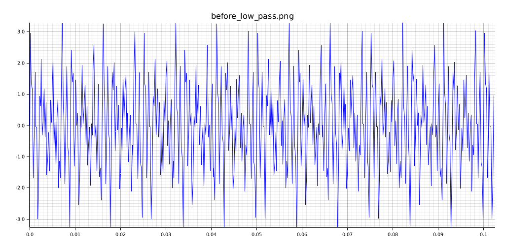

# Corroded CUDA

This is a small collection of CUDA kernels written in the Rust programming language.
It utilizes the (`rust-cuda`)[https://github.com/Rust-GPU/rust-cuda/tree/main] repository's crates
to allow kernels to be created end-to-end in Rust.

There is also some rudimentary Digital Signal Processing found here. This includes some kernels
written for sinusoidal signal generation, as well as a CPU-driven version to compare GPU algorithm
speeds to. There is also a Low-Pass Filter implementation that runs on the generated signal.
I recommend playing around with the various parameters to see how they affect the resulting signals,
filtered and unfiltered.

The figures below use a generated signal with frequency bands at 440 Hz, 880 Hz, 1000 Hz, 2000 Hz; a sampling rate
of 5000 Hz, and a sample count of 512. The cutoff frequency is at 500 Hz, so only the 440 Hz band remains after filtering.



---


## Dependencies

The `rust-cuda` libraries have some strange dependencies. I've added some tooling to make things easier
to get it all set up.

The only requirement is that you have an Nvidia GPU and the `nvidia-container-toolkit` and Docker installed.

The only step to get the environment running is to run this script:

```
./start_env.sh
```

This will launch you into a new docker container after building it with the correct dependencies. All that's left to
do is run `cargo run`, and the rest should happen automatically.

This project uses crates from the `rust-cuda` repository, as well as the `rustfft` and `plotters` crates, which are used
for calculating and reporting data for the Fast Fourier Transform algorithm to process signal frequency bands.

## Kernels

There are 3 kernels included in this project. The first one, `add`, is a simple vector addition, collecting
the elements of two f32 vectors into a single vector.

The other two are sinusoidal signal generators. They both run considerably faster than the CPU-driven version,
just found in main.rs. The first, `generate_signal_1d`, is a straightforward GPU-driven signal generator, that
uses global memory to write to the output. The second, `generate_signal_1d_shared_mem`, is also GPU-driven, but
it utilizes shared_memory to share the memory across threads in a block. This is an optimization that can greatly
speed up CUDA kernels. In this specific case, it is a little faster, but not much.

